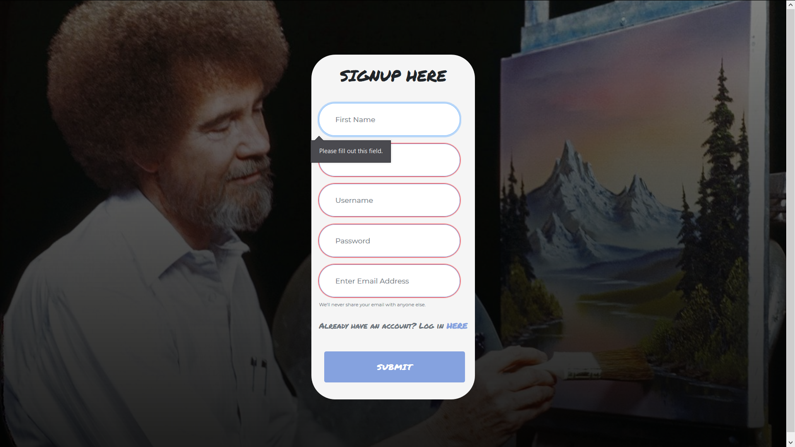
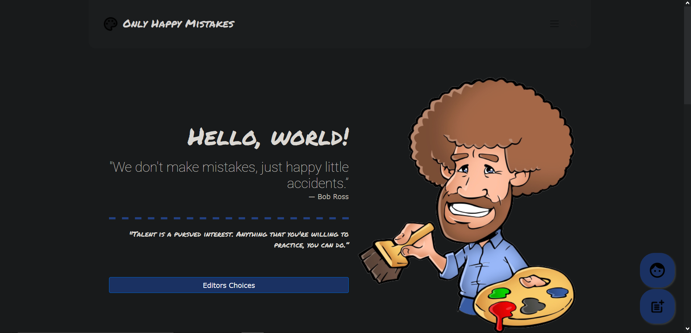

# Happy-Little-Mistakes-OHMs-

## Objective
  
The objective of this website is to create a platform at which users can upload and browse visual arts, buy and sell their creations, and have their art featured on the home page . 
This website will also enable users to generate a presence in the visual arts community at which employers can reach out to users in order to contact them on their respective social media accounts.
  
 ### Components Used
 
    
 
 
 **Lightbox.JS and CSS was used. http://lokeshdhakar.com/projects/ligh…
 
## ScreenShots
  
 Signin Screen | Signup Screen
-------------------------|-------------------------
  | 

Profile Page (Accessed through profile btn at bottom right corner of page) | Upload Images(Accessed through upload btn at bottom right corner of page)
-------------------------|-------------------------
 | 

Voting | Lightbox
-------------------------|-------------------------
 | 

Navbar | Responsive Website & Navbar
-------------------------|-------------------------
 | 

Dark Mode Extensions adaptive  | Logout Page
-------------------------|-------------------------
 | 
